# 📚 Git Version Control System (VCS)

# 📖 Table of Contents
1. [Introduction](#introduction)
2. [Key Concepts](#key-concepts)
3. [Why use Version Control](#Why-use-Version-Control)          
4. [Basic Git Workflow](#basic-git-workflow)
5. [Best Practices](#best-practices)
6. [Common Git Commands](#common-git-commands)


## Introduction
A **Version Control System (VCS)** is a tool that helps track changes in code, documents, or any set of files over time.  
It allows teams to:
- Collaborate without overwriting each other’s work.
- Revert to previous versions if mistakes are made.
- Maintain a clear history of changes.


## Key Concepts

| Term | Description |
|-----------------|-------------|
| **Repository** | A storage location for your project files and history. |
| **Commit** | A snapshot of changes made to the codebase. |
| **Branch** | A parallel version of the repository for isolated changes. |
| **Merge** | Combining changes from one branch into another. |
| **Clone** | Creating a local copy of a remote repository. |
| **Pull** | Fetching and integrating changes from a remote repository. |
| **Push** | Sending your local changes to a remote repository. |


## Popular Version Control Systems
1. **Git** (Most popular, distributed, open-source)
2. **Subversion (SVN)** (Centralized)
3. **Mercurial**
4. **Perforce**


## Why Use Version Control
- **Collaboration**: Multiple people can work on the same project.
- **History Tracking**: Every change is recorded.
- **Backup**: Code is safely stored in the cloud or remote servers.
- **Branching**: Experiment without affecting main code.


## Basic Git Workflow

flowchart LR
A[Make Changes] --> B[Stage Changes: git add]
B --> C[Commit: git commit]
C --> D[Push: git push]
D --> E[Remote Repository]
Branching Strategy
Common strategies:

Main/Develop:

main for production-ready code.

develop for ongoing development.

Feature Branches: For new features.

Hotfix Branches: For urgent production fixes.

Release Branches: For preparing production releases.

Example:

``` bash
Copy
Edit
main
│
├── develop
│ ├── feature/user-auth
│ ├── feature/payment-api
│
└── hotfix/login-bug
```
* Best Practices

✅ Commit often with clear messages.
✅ Use .gitignore to avoid committing unnecessary files.
✅ Pull before pushing to reduce merge conflicts.
✅ Keep branches focused on a single task/feature.
✅ Regularly review pull requests.

## Common Git Commands

Command Description

* Git Init 
* Git clone https://github.com/TheCollinskb/VCS-project.git
* Git status 
* Git add .
* Git commit -m "message" Commit staged changes
* Git pull fetch and merge remote changes
* Git push Push commits to remote repository
* Git branch List branches
* Git checkout Tom
* Git checkout Jerry
* Git checkout Main
* Git merge


## Why Use Version Control
- **Collaboration**: Multiple people can work on the same project.
- **History Tracking**: Every change is recorded.
- **Backup**: Code is safely stored in the cloud or remote servers.
- **Branching**: Experiment without affecting main code.


## Version Control Workflow

📷 *Image Placeholder: Workflow 
`

### Project Workflow:
bash
# 1. Initialize a new Git repository
* Git init

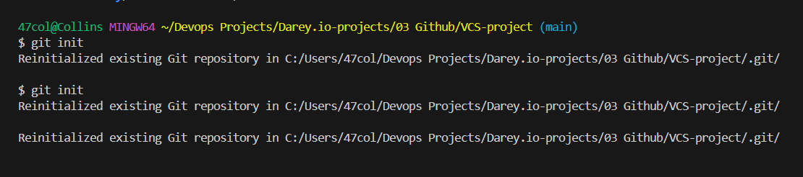

# 2. Stage changes
* Git add .

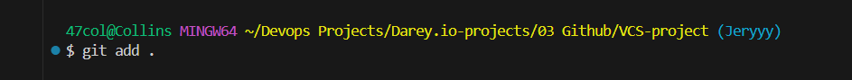

# 3. Commit staged changes and pushed to main branch
* Git commit -m "Initial commit"
* Git push origin main

📷 Image Placeholder: Screenshot of a clean
* Git commit history
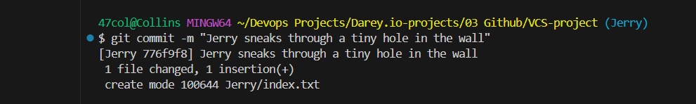


📷 Image Placeholder: Terminal screenshot of 
* Git status output

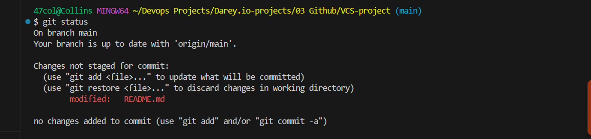


📷 Image Placeholder: Tom's branch


📷 Image Placeholder: Jerry's branch
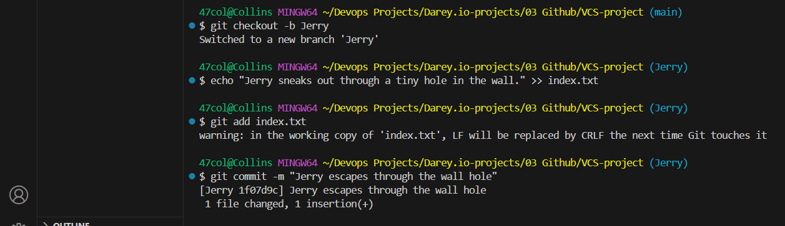

📷 Image Placeholder: index file
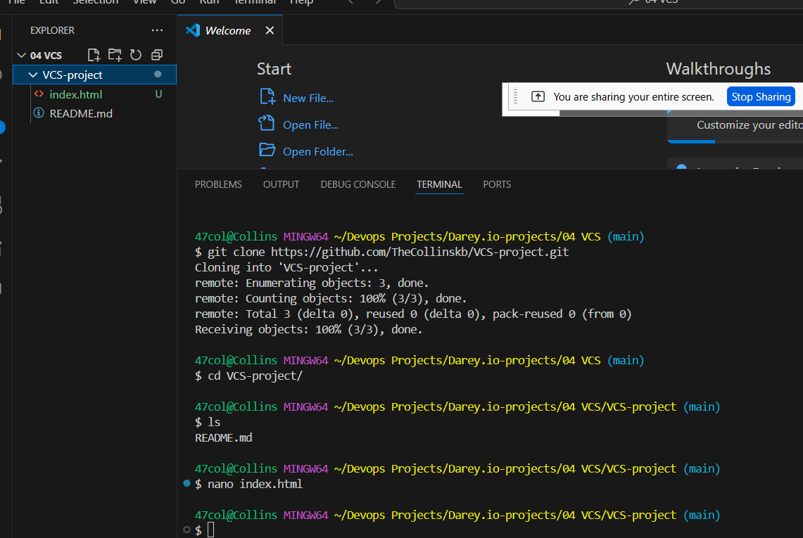

📷 Image Placeholder: Pull request
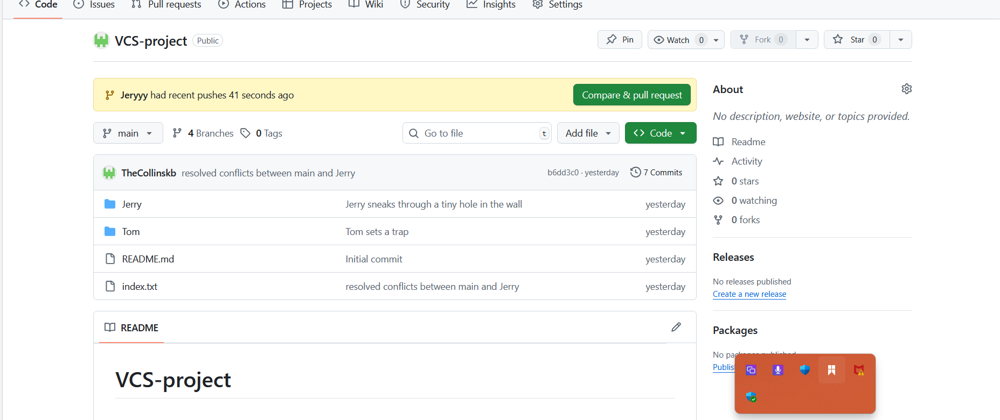

📷 Image Placeholder: Merged changes
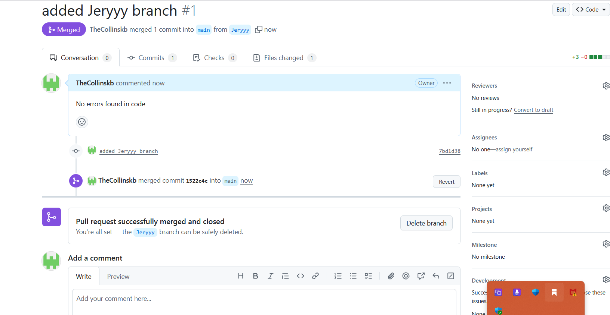

📷 Image Placeholder: Git merge Jerry
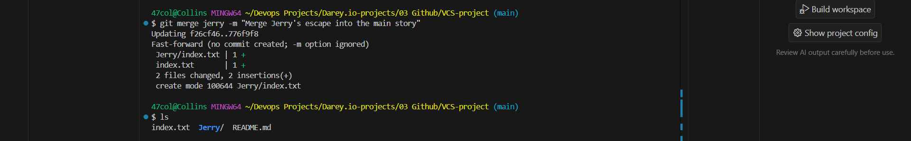

📷 Image Placeholder: Git merge Tom
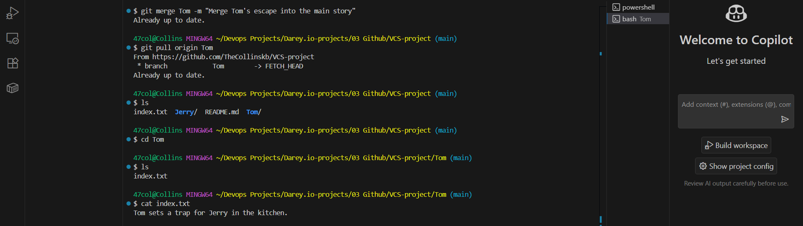

📷 Image Placeholder: Tom's Push
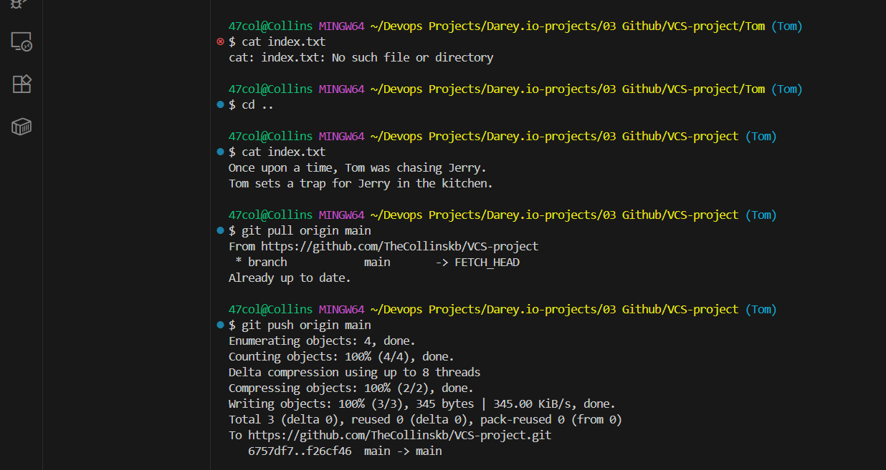

📷 Image Placeholder: Git push main


	
